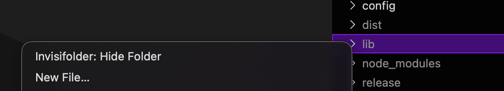
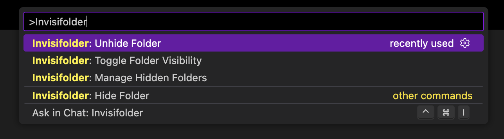
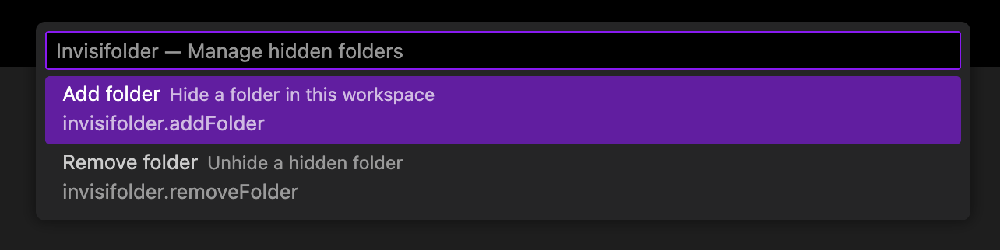
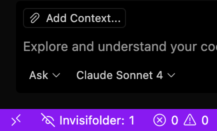
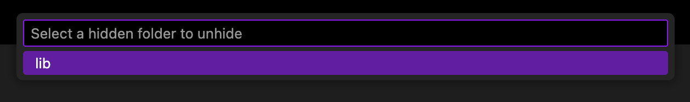

# Invisifolder

Hide selected folders in VS Code for a cleaner workspace.

## Features

- Hide/unhide folders per-workspace.
- Settings stored in `.vscode/settings.json` (`invisifolder.hiddenFolders`).
- Explorer context menu and Status Bar management.
- Updates `files.exclude` to hide folders from Explorer.

## Commands

- `Invisifolder: Hide Folder` — Hide a folder (Explorer context menu or command palette).
- `Invisifolder: Unhide Folder` — Remove a folder from hidden list (command palette or status bar).
- Click the status bar item to manage hidden folders with a quick menu.

## How it stores settings

Hidden folders are saved in workspace settings:
```json
"invisifolder.hiddenFolders": ["dist", "build"]
```
The extension will map these to `files.exclude` patterns.

## Usage

### Hiding Folders

1. **Via Explorer Context Menu**: Right-click any folder in the Explorer and select "Invisifolder: Hide Folder"

   

2. **Via Command Palette**: Press `Ctrl+Shift+P` (or `Cmd+Shift+P` on Mac), type "Invisifolder: Hide Folder", and follow the prompts

   
   
   

3. **Via Status Bar**: Click the Invisifolder status bar item (shows "👁️‍🗨️ Invisifolder: X") and select "Add folder"

   

### Unhiding Folders

1. **Via Command Palette**: Press `Ctrl+Shift+P`, type "Invisifolder: Unhide Folder", and select a folder from the list

   

2. **Via Status Bar**: Click the Invisifolder status bar item and select "Remove folder"

### Managing Hidden Folders

Click the status bar item to see a quick overview of hidden folders and manage them through a convenient menu.

## Configuration

The extension stores hidden folders in your workspace settings (`.vscode/settings.json`):

```json
{
  "invisifolder.hiddenFolders": [
    "dist",
    "packages/foo/build"
  ],
  "files.exclude": {
    "dist/**": true,
    "packages/foo/build/**": true
  }
}
```

## Contributing

Contributions welcome — open issues or PRs. Run `npm run compile` before pushing.

## License

MIT
